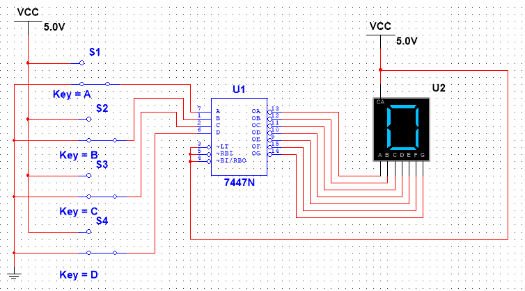

# 7-Segment-Display-In-Multisim
## Overview
This project aims to illustrate the usage of a 7-segment display in displaying decimal numbers by accepting a 4-bit binary input. A BCD to 7-segment display IC is utilized in the project to convert the input binary number into the required signals for the display. The project was designed and simulated in Multisim.

## Components Used
- 7447 BCD to 7-segment display IC
- 7-segment display (common anode type)
- Toggle switches (for input)
- 5V DC power supply
- Connecting wire
  
## Circuit Description
The project uses 4 switches to accept a 4-bit binary input (A, B, C, D). This binary input is then connected to the IC, which then converts the input binary number into the required signals for the display. Depending on the input, the display will then display the corresponding decimal number from 0 to 9.

## Working
Each switch represents one bit of the binary input. By setting the switches ON or OFF, various binary inputs can be entered.
For example:
- 0000 → displays 0
- 0001 → displays 1
- 0010 → displays 2
- 0101 → displays 5
The decoder will turn ON the necessary segments to display the correct number on the display.

## Features
- Simple circuit to understand
- Real-time inputs are provided by the switches
- Displays decimal values (0 to 9) accurately
- Used for learning basic digital electronics
  
## Limitations
- It only supports values from 0 to 9
- It does not work for values above 1001 (or 9)
- It must be connected correctly and have power supply connected
  
## Applications
- Digital clocks
- Counters
- Simple calculators
- Display units of embedded systems
  
## Conclusion
This project is useful in understanding the conversion of binary numbers into decimal using a decoder and a 7-segment display. It is an essential concept of digital electronics.
